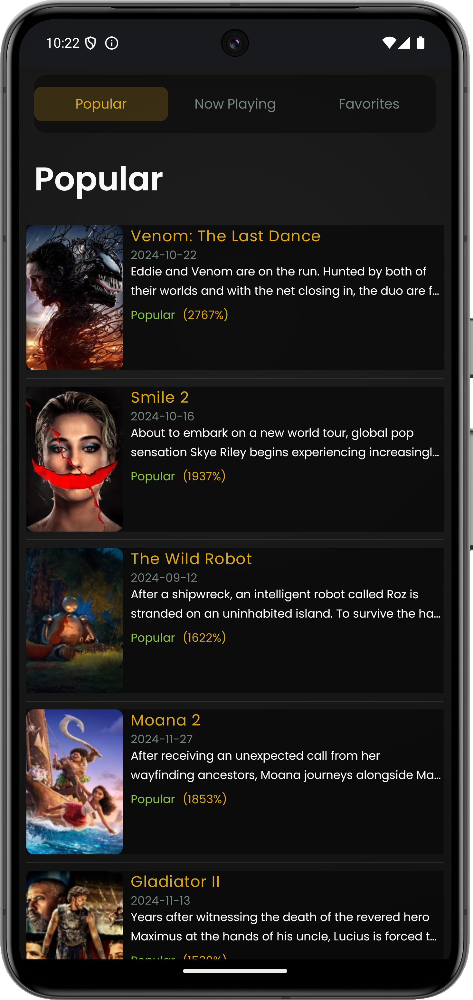
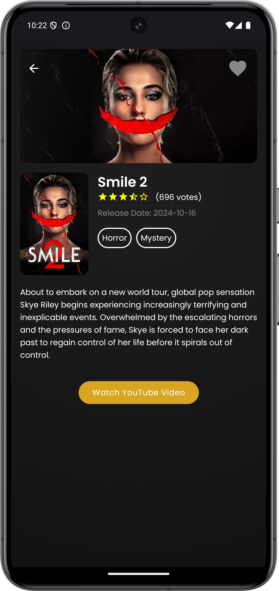
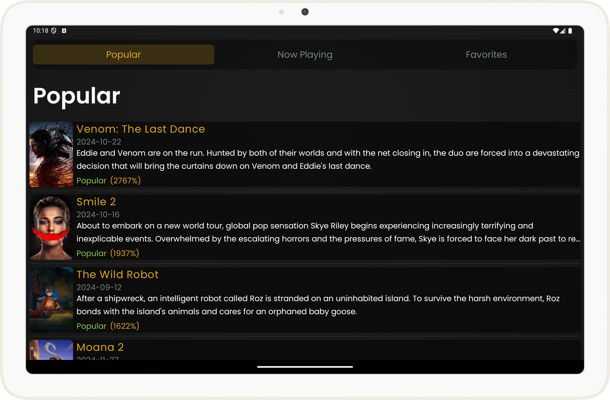
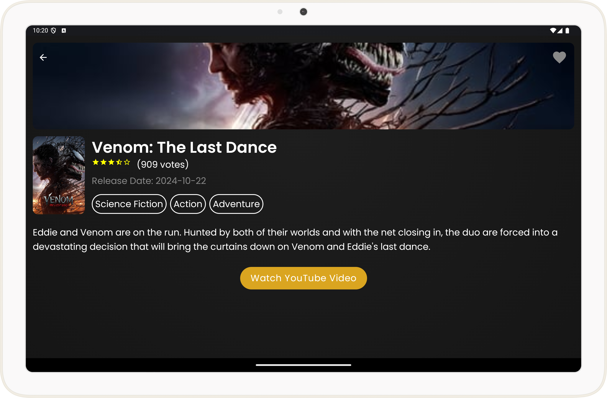

# Movie DB  

The Movie App allows users to browse movies, view details, and watch the latest related video of that movie directly from YouTube. The app is designed with responsiveness in mind, ensuring compatibility with phones and tablets.

## Navigation Bar
- [**Features**](#features)
- [**Technologies Used**](#technologies-used)
- [**Screenshots**](#screenshots)
- [**Usage**](#usage)

## Features

- **Browse Movies**: Fetches movie data from The Movie Database (TMDB) API, including popular movies, currently playing, and favorites.

- **Responsive Design**: Designed to be fully responsive and visually appealing on both phones and tablets.

- **Custom Themes**: Includes a custom theme with tailored text styles, font sizes, and colors for compatibility across different screen sizes.

- **YouTube Player**: Watch latest related video directly in the app with YouTube Player integration.

- **Favorites Management**: Save your favorite movies.

- **Keyboard Navigation**: Navigate seamlessly through the app using arrow keys, ENTER, and ESCAPE buttons.

- **Optimized Performance**: Efficiently loads movie data and ensures a fast app startup time.

- **Error Handling**: Displays appropriate error messages for network and API issues, ensuring a smooth user experience.

## Technologies Used

* Kotlin
* Jetpack Compose
* Clean Architecture
* MVVM Architecture
* Room Database
* Retrofit
* Coroutines and Flows
* Dependency Injection (Hilt)
* YouTube Player API
* Custom Themes and Typography
* Coil
* Navigation
* HorizontalPager
* Pagination (Efficient Data Loading)

## Screenshots

### Phones:

|  |  | 
|:--------------------------------------------:|:--------------------------------------------:|

### Tablets:

## Usage

**Before Running The App**:

- 1 . Go to https://www.themoviedb.org
- 2 . Sign In / Create Account
- 3 . Go to API key settings (if you cant see it go to -> https://www.themoviedb.org/settings/api)
- 4 . Copy the generated key

Once you obtained your API key, you can open your **local.properties** file in your project's top level folder, and add the following line in it:

**Add to local.properties:**

    TMDB_API_KEY = "YOUR_API_KEY"

- Make sure your emulator/device is connected and recognized by Android Studio.
- Click the "Run" button in Android Studio to build and launch the app.
- The app will load the movie app.

### Thank You And Enjoy!  

